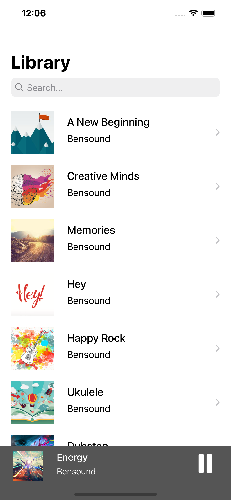
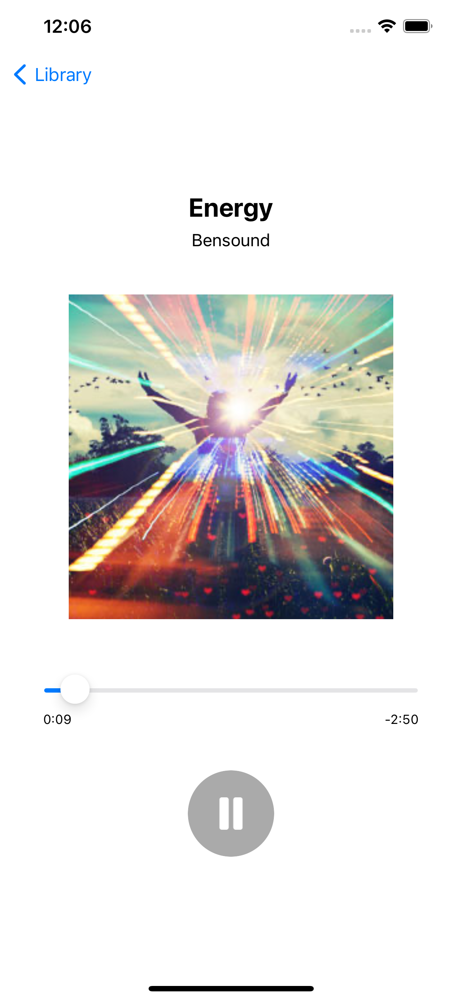
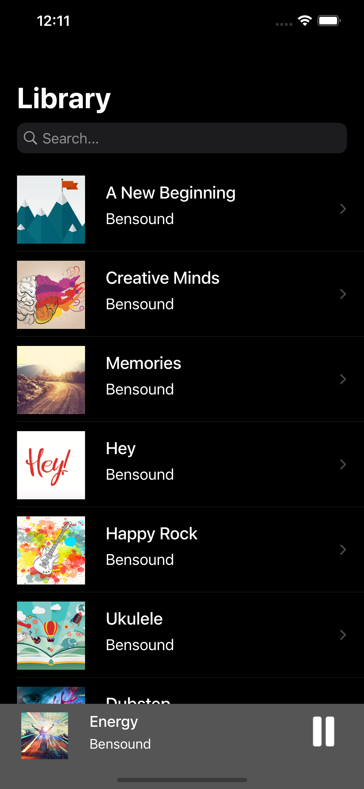
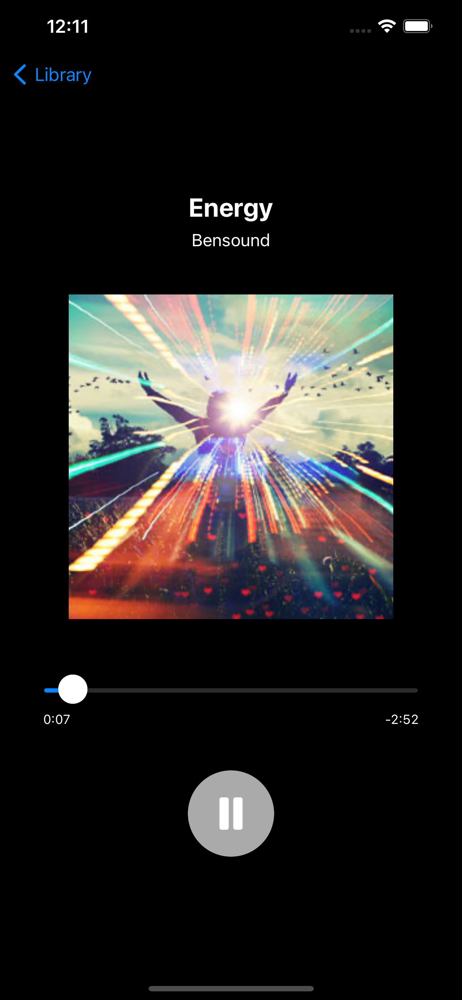

<div align="center">
	
</div>

# MusicAll [](http://makeapullrequest.com)
Music player made for iOS devices, it allows to listen a music in the same way like Spotify or Apple Music do. You can also connect this app to your own back-end service!

## Screenshots
### Light mode
<div align="center">
	
	
</div>

### Dark mode
<div align="center">
	
	
</div>

## Features
- Support for light and dark mode
- Handling audio playing in the background
- Remote controling audio (stop/pause) by Command Center
- Rewinding audio by dragging slider
- Possibility to connect to any back-end service

## Usage
Clone this repository, open at the Xcode and turn it on at your iPhone using `Command + R`.

## Connecting back-end
You can connect this app to your own back-end service, your service has to sending response in the following way by using JSON format.
```json
[
	{
		"songName":"",
		"songURL":"",
		"songArtwork":""
	}
]
```
It's also required to paste URLs to your API in the code to start the connection.

## Author
Patryk Krajnik • patrykkrajnik@icloud.com


## License
Project based on [MIT License](LICENSE.md)